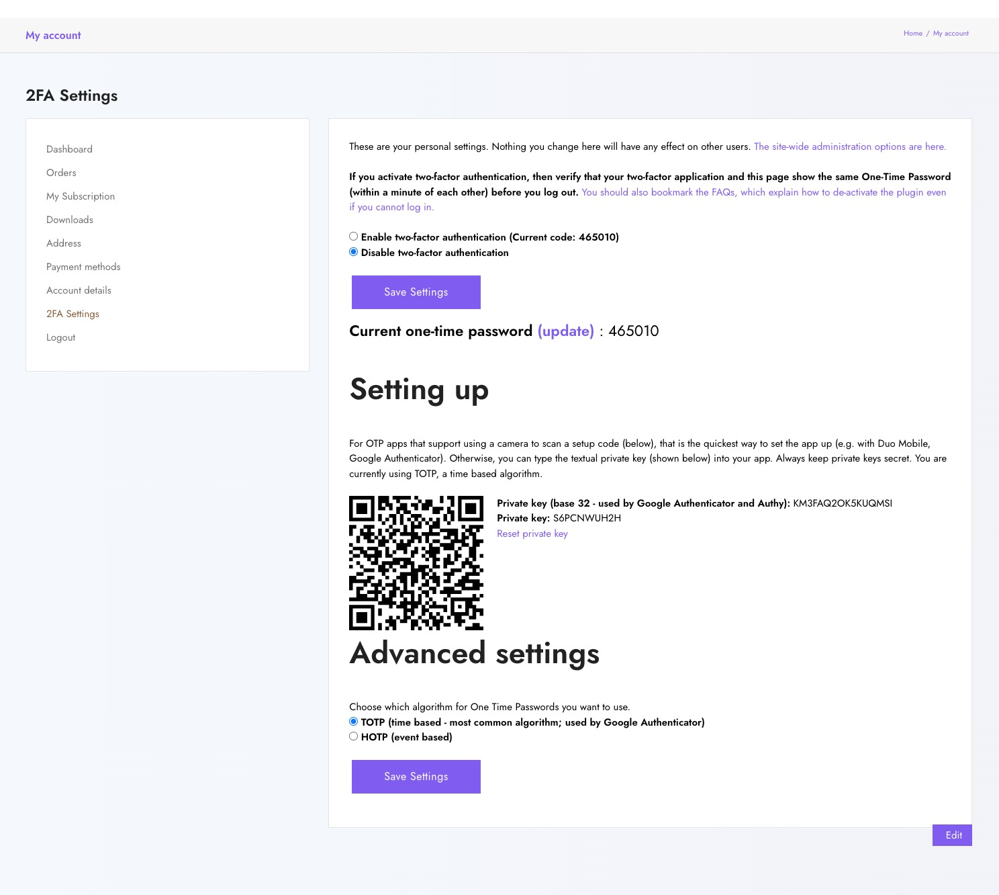

# Absolute 2fa For Woocommerce

[Absolute 2fa For Woocommerce](https://wordpress.org/plugins/absp-2fa-for-woocommerce/) is a [Two Factor Authentication](https://wordpress.org/plugins/two-factor-authentication/) addon that will add 2fa settings page under WooCommerce's My Account Page.

      
    Made with 💜 by <a href="https://absoluteplugins.com/">AbsolutePlugins</a>. 
    <a href="https://www.facebook.com/pixelaarllc/jobs/">We're hiring</a>! Come work with us!

